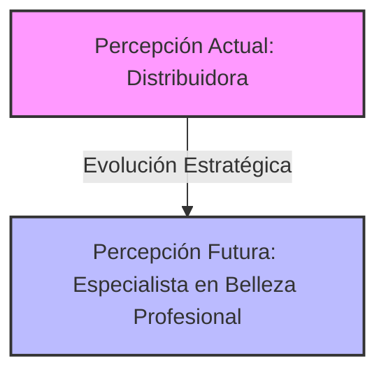
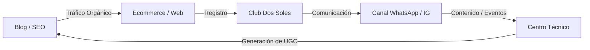

# Análisis del Plan Estratégico: Dos Soles

Este documento presenta un análisis estructurado del **Plan Estratégico de Marketing, Comunicación y Posicionamiento** diseñado para **Dos Soles** para un período de ejecución de 12 meses. El plan aborda la transición de la empresa desde una identidad puramente B2B (distribuidora) hacia un modelo híbrido B2B + B2C impulsado por un ecosistema de valor.

---

## 1. Resumen Ejecutivo y Objetivo General

El objetivo principal es **diseñar e implementar una estrategia integral de crecimiento B2B + B2C** que:
1. Fortalezca el liderazgo de Dos Soles en el sector profesional (B2B).
2. Impulse la expansión hacia el consumidor final (B2C) sin descuidar ni alienar al profesional de la belleza.
3. Posicione la marca como un referente nacional a través de un ecosistema digital integrado.

---

## 2. Diagnóstico de Marca: El Problema de Percepción

El diagnóstico revela que **Dos Soles es mucho más fuerte de lo que su comunicación actual transmite**. 

* **Subcapitalización de marca:** La comunicación actual está excesivamente centrada en las marcas de terceros (L'Oréal, Matrix, Truss, etc.). Esto genera el riesgo de que el cliente elija a otros distribuidores que ofrecen el mismo catálogo.
* **El síntoma de "distribuir":** La comunicación resume la empresa en una sola función de entrega física, ocultando activos de altísimo valor como el **Centro Técnico**, el **Showroom** y su equipo de asesores especializados.
* **La evolución propuesta:** Pasar del enfoque de venta *"Vendemos productos profesionales"* al enfoque de solución *"Somos el lugar donde profesionales y consumidores encuentran la mejor solución para su cabello"*.

---

## 3. Propuesta de Valor y Reposicionamiento

Para superar la competencia por precio y comoditización, Dos Soles redefine su estrategia bajo una nueva identidad:

* **Propósito de Marca:** *Democratizar el acceso a la belleza profesional.*
* **Slogan y Promesa Central:** *"La experiencia de los profesionales, ahora también para vos."*
* **El nuevo rol:** La marca actúa como un **puente** que conecta la sabiduría de los estilistas con las necesidades cotidianas del consumidor final, basando su relación en la confianza y la educación.

### Los Tres Perfiles Clave (Customer Personas)
* **Carolina (33 años - B2C):** Compra online, sigue tendencias pero no entiende las diferencias técnicas entre marcas. Necesita recomendaciones claras y honestas.
* **Mariana (42 años - B2C):** Asidua a la peluquería, busca mantener el resultado del salón en casa y está dispuesta a pagar más por calidad y resultados reales.
* **Nicolás (Peluquero - B2B):** Requiere stock constante, capacitaciones técnicas continuas, velocidad en el soporte y ser tratado como un socio estratégico.

---

## 4. Matriz FODA (Fortalezas, Debilidades, Oportunidades y Amenazas)

| Fortalezas | Debilidades |
| :--- | :--- |
| • 19 años de trayectoria y reputación profesional. • Centro Técnico y capacitaciones permanentes. • Distribuidor oficial de primeras marcas. • Showroom propio y canal de e-commerce ya activo. | • Marca institucional eclipsada por las marcas que vende. • Comunicación excesivamente transaccional (producto/precio). • Escasa comunicación emocional y contenido educativo evergreen. |
| **Oportunidades** | **Amenazas** |
| • Crecimiento del consumo de cosmética profesional en casa. • Consumidor final buscando rutinas completas y educación. • SEO con Inteligencia Artificial y automatización de marketing. • Creación de una comunidad cerrada (Club Dos Soles). | • Expansión de marketplaces globales (Mercado Libre). • Competencia directa por precio con otros distribuidores. • Incremento constante en el costo de adquisición de clientes (CAC). |

---

## 5. El Ecosistema Digital Dos Soles

El plan propone un ecosistema digital omnicanal e integrado. Ningún canal debe operar de forma aislada; cada punto de contacto debe retroalimentar al siguiente:

### Componentes Clave:
1. **Nueva Plataforma Web:** Concebida no solo como carrito de compras, sino como una herramienta de diagnóstico. La navegación debe guiar al usuario según su necesidad (ej: *"Tengo frizz"* o *"Cabello decolorado"*) y no solo por marcas.
2. **WhatsApp Consultivo:** WhatsApp deja de ser soporte reactivo para transformarse en una herramienta de asesoramiento activo (*"Contanos cómo es tu cabello y te recomendamos la rutina ideal"*).
3. **Estrategia de Redes Sociales (Distribución 40-20-20-20):**
   * **40% Educación:** Consejos, tutoriales, errores comunes, diagnósticos.
   * **20% Inspiración:** Transformaciones ("antes y después"), estilos, tendencias.
   * **20% Autoridad:** Cobertura de capacitaciones, Centro Técnico, marcas oficiales.
   * **20% Comercial:** Lanzamientos, combos, promociones.
4. **Club Dos Soles:** Comunidad exclusiva que integra a estilistas, alumnos y consumidores finales con acceso a sorteos, preventas, capacitaciones y eventos privados.

---

## 6. Oportunidades Prioritarias y Plan de Acción

Las prioridades de implementación se ordenan por su impacto estratégico:

### Muy Alto Impacto (Fase 1 - Prioritaria)
* **Redefinición e identidad verbal:** Establecer las pautas del nuevo tono de comunicación (Profesional, Cercano, Inspirador, Positivo).
* **Desarrollo del canal B2C:** Configurar la nueva web enfocada en conversión mediante diagnósticos y rutinas sugeridas.
* **SEO de contenidos:** Crear artículos que respondan a preguntas reales de los usuarios (ej: *"Cómo mantener el color por más tiempo"*).
* **Lanzamiento del Canal de WhatsApp** como canal editorial y de fidelización directa.

### Alto Impacto (Fase 2)
* **Automatización de Email Marketing:** Configuración de flujos para carritos abandonados, bienvenida y recomendaciones según historial de compra.
* **Estrategias de venta cruzada y bundles:** Agrupación de productos en kits completos para simplificar la compra del consumidor B2C.
* **Experiencias presenciales en Showroom** y eventos abiertos para la comunidad.
